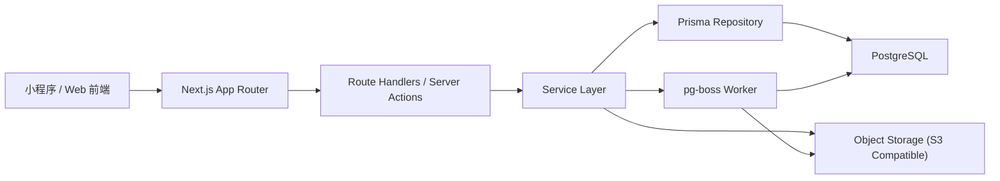
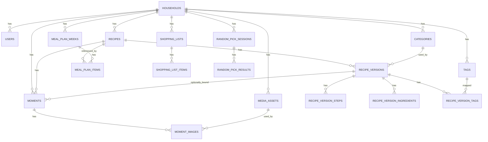

# 食光记后端技术方案（Next.js + PostgreSQL）

## 1. 文档说明

### 1.1 文档目标

本文档基于 [需求文档v2.md](D:\AI\Menu%20Time\docs\需求文档v2.md) 输出“食光记”后端技术方案，作为后续后端开发、数据库设计、接口拆分、联调与部署的指导文档。

本文档重点回答以下问题：

- 后端整体架构如何落地。
- Next.js 在本项目中承担哪些后端职责。
- PostgreSQL 数据模型如何设计，如何兼顾 MVP 与后续扩展。
- 各业务模块的接口、事务、异步任务与约束如何定义。
- 后续开发建议按什么顺序推进。

### 1.2 适用范围

- 当前阶段：MVP 单家庭单管理员优先。
- 后续兼容：家庭协作、随机点菜增强、推荐能力、导出能力。
- 技术约束：后端以 `Next.js + TypeScript + PostgreSQL` 为主，不额外引入复杂微服务体系。

### 1.3 范围说明

本文档以 `docs/需求文档v2.md` 为主设计依据，同时参考 `docs/backend/后端开发TODO.md` 与 `docs/frontend/前端开发TODO.md` 中对 MVP 的收敛建议。结论如下：

- 数据模型按 PRD V2 完整能力设计，预留随机点菜与家庭成员扩展位。
- 首期开发按 MVP 闭环优先，不一次性实现所有增强能力。
- 文档中的“推荐实现”默认兼顾个人开发效率与后期可扩展性。

## 2. 设计目标与原则

### 2.1 核心设计目标

1. 支持“菜谱 -> 版本 -> 时光记录 -> 点菜 -> 购物清单”的核心数据闭环。
2. 保证版本历史可追溯，不因编辑当前内容破坏历史快照。
3. 让随机点菜、家庭协作等二期能力可以增量接入，而不是推翻重做。
4. 尽量把复杂度收敛在服务层和数据库模型中，保持前端页面实现简单。

### 2.2 设计原则

- 单体优先：MVP 阶段采用 Next.js 单体应用承载 API、后台任务入口与管理页面。
- 数据先稳：优先设计稳定的数据模型和事务边界，避免页面完成后反复改表。
- 快照优先：涉及“历史记录”的业务统一采用快照思路，确保过去数据可复现。
- 渐进增强：复杂能力先做规则版，后续再做算法或智能化升级。
- 可观测性内建：从第一版开始保留日志、审计字段、任务状态字段，方便排障。

## 3. 推荐技术栈

### 3.1 基础技术栈

| 层级 | 方案 | 说明 |
| --- | --- | --- |
| Web 框架 | Next.js 15+（App Router） | 同时承载页面、Route Handlers、Server Actions |
| 语言 | TypeScript | 统一类型约束 |
| 数据库 | PostgreSQL 16+ | 关系建模强、JSONB 灵活、适合后续统计与检索 |
| ORM | Prisma | 迁移、关系建模、事务能力成熟，适合个人开发效率 |
| 参数校验 | Zod | API 输入输出约束，减少脏数据 |
| 鉴权 | 微信 `code2Session` + 自签 `accessToken/refreshToken` | 小程序主链路使用 token 鉴权，后续 Web 端可按需补 Auth.js |
| 文件存储 | S3 兼容对象存储 | 用于时光图片、菜谱封面、购物清单分享图 |
| 异步任务 | pg-boss | 基于 PostgreSQL 的任务队列，避免额外引入 Redis |
| 日志 | Pino | 结构化日志，便于排障 |
| 监控 | Sentry + 健康检查接口 | 运行期错误追踪与上线巡检 |

### 3.2 选择理由

#### Next.js

- 前后端一体，适合当前轻量团队和快速迭代。
- `app/api` 路由可直接提供 REST API。
- 后续如果前端为小程序或 Taro，也可以仅把 Next.js 当纯后端服务使用。

#### PostgreSQL

- 关系强，适合菜谱、版本、周计划、购物清单这类有明确关联的数据。
- `JSONB` 可用于保存 diff 明细、筛选快照、随机抽取 session 上下文等半结构数据。
- 适合后续做统计、全文检索、推荐候选池过滤。

#### Prisma

- 迁移链路清晰，便于维护表结构演进。
- 事务和关联查询足够覆盖当前场景。
- 团队未来扩大时，上手成本也较低。

#### pg-boss

- 随机点菜历史、购物清单快照、封面回填、分享图生成都可能转为异步任务。
- 基于 PostgreSQL 即可运行，部署简单。

## 4. 总体架构设计

### 4.1 架构概览



### 4.2 分层建议

建议在 Next.js 项目中采用如下后端目录结构：

```text
src/
  app/
    api/
      v1/
        recipes/
        moments/
        menu-plans/
        random-picks/
        shopping-lists/
        taxonomies/
        auth/
  server/
    modules/
      auth/
      recipes/
      moments/
      plans/
      random/
      shopping/
      taxonomy/
    db/
      client.ts
      transactions.ts
    lib/
      zod/
      errors/
      logger/
      storage/
      jobs/
      diff/
      parser/
  types/
prisma/
  schema.prisma
  migrations/
```

### 4.3 分层职责

| 层 | 职责 |
| --- | --- |
| Route Handlers | 接收请求、鉴权、参数校验、调用服务、输出统一响应 |
| Service Layer | 承载业务规则、事务、聚合查询、状态变更 |
| Repository / Prisma | 数据访问、关联查询、批量写入 |
| Jobs | 低实时性任务，如封面回填、分享图生成、统计刷新 |
| Storage Adapter | 上传图片、生成访问 URL、缩略图处理 |

## 5. 业务模块拆分

### 5.1 模块边界

1. `auth`：登录、会话、家庭成员与角色。
2. `recipes`：菜谱、版本、版本切换、版本差异。
3. `taxonomy`：分类、标签、自定义排序。
4. `moments`：时光记录、图片、评分、参与人。
5. `plans`：周菜单、菜单项、排序与版本绑定。
6. `random`：随机点菜、候选池过滤、session 历史。
7. `shopping`：购物清单生成、清单项状态、导出。
8. `files`：图片上传签名、资源元数据、预览与下载链接。

### 5.2 模块关系

- 菜谱是主实体。
- 版本、时光记录、菜单项、随机候选、购物清单都围绕菜谱展开。
- 周菜单和购物清单属于“计划域”，但购物清单必须保留生成快照，不能每次实时重算覆盖用户勾选状态。

## 6. 数据模型设计

### 6.1 建模总原则

- 所有业务数据默认带 `household_id`，即使 MVP 只有一个家庭，也为二期协作预留。
- 所有“历史回看”场景尽量存快照，而不是仅存实时引用。
- 所有列表实体都包含 `created_at`、`updated_at`、`deleted_at`，删除优先采用软删除。
- 核心状态切换必须可审计，至少保留 `created_by`、`updated_by`。

### 6.2 核心实体 ER 图



### 6.3 表清单

#### 6.3.1 用户与家庭

##### `households`

| 字段 | 类型 | 说明 |
| --- | --- | --- |
| `id` | uuid | 主键 |
| `name` | varchar(100) | 家庭名称 |
| `status` | varchar(20) | `active / archived` |
| `created_at` | timestamptz | 创建时间 |

##### `users`

| 字段 | 类型 | 说明 |
| --- | --- | --- |
| `id` | uuid | 主键 |
| `household_id` | uuid | 所属家庭 |
| `email` | varchar(150) | 可空，后续可做邮箱登录 |
| `nickname` | varchar(50) | 展示名 |
| `role` | varchar(20) | `admin / member` |
| `password_hash` | varchar(255) | MVP 管理员账号可采用账号密码 |
| `status` | varchar(20) | `active / invited / disabled` |
| `created_at` | timestamptz | 创建时间 |
| `updated_at` | timestamptz | 更新时间 |

#### 6.3.2 分类与标签

##### `categories`

| 字段 | 类型 | 说明 |
| --- | --- | --- |
| `id` | uuid | 主键 |
| `household_id` | uuid | 所属家庭 |
| `name` | varchar(50) | 分类名，家庭内唯一 |
| `sort_order` | int | 排序 |
| `color` | varchar(20) | UI 展示色，可空 |
| `created_at` | timestamptz | 创建时间 |
| `updated_at` | timestamptz | 更新时间 |
| `deleted_at` | timestamptz | 软删除 |

##### `tags`

| 字段 | 类型 | 说明 |
| --- | --- | --- |
| `id` | uuid | 主键 |
| `household_id` | uuid | 所属家庭 |
| `name` | varchar(50) | 标签名，家庭内唯一 |
| `sort_order` | int | 排序 |
| `created_at` | timestamptz | 创建时间 |
| `updated_at` | timestamptz | 更新时间 |
| `deleted_at` | timestamptz | 软删除 |

#### 6.3.3 媒体资源

##### `media_assets`

| 字段 | 类型 | 说明 |
| --- | --- | --- |
| `id` | uuid | 主键 |
| `household_id` | uuid | 所属家庭 |
| `asset_key` | varchar(255) | 对象存储 Key |
| `asset_url` | varchar(500) | 对外访问地址 |
| `mime_type` | varchar(100) | 文件类型 |
| `size_bytes` | bigint | 文件大小 |
| `width` | int | 宽度，可空 |
| `height` | int | 高度，可空 |
| `purpose` | varchar(30) | 当前实现固定为 `image` |
| `created_by` | uuid | 上传人 |
| `created_at` | timestamptz | 创建时间 |

说明：

- `media_assets` 作为统一媒体资源表，时光图片、菜谱封面、分享图都可以复用。
- `recipes.cover_image_id` 建议引用本表，而不是直接引用 `moment_images`。

#### 6.3.4 菜谱主表

##### `recipes`

| 字段 | 类型 | 说明 |
| --- | --- | --- |
| `id` | uuid | 主键 |
| `household_id` | uuid | 所属家庭 |
| `name` | varchar(120) | 菜谱名称 |
| `slug` | varchar(160) | 可选友好标识 |
| `current_version_id` | uuid | 当前默认版本 |
| `cover_image_id` | uuid | 当前封面资源 ID，可空 |
| `cover_source` | varchar(20) | `custom / moment_latest / none` |
| `latest_moment_at` | timestamptz | 最近记录时间，列表排序用 |
| `latest_cooked_at` | date | 最近做菜日期，可空 |
| `version_count` | int | 冗余字段，便于列表展示 |
| `moment_count` | int | 冗余字段，便于列表展示 |
| `status` | varchar(20) | `active / archived` |
| `created_by` | uuid | 创建人 |
| `created_at` | timestamptz | 创建时间 |
| `updated_at` | timestamptz | 更新时间 |
| `deleted_at` | timestamptz | 软删除 |

说明：

- `recipes` 代表“一道菜”的概念实体。
- 当前展示内容以 `current_version_id` 指向的版本为准。
- 切换历史版本为当前版本时，只更新 `current_version_id`，不修改历史版本内容。

#### 6.3.5 菜谱版本

##### `recipe_versions`

| 字段 | 类型 | 说明 |
| --- | --- | --- |
| `id` | uuid | 主键 |
| `recipe_id` | uuid | 所属菜谱 |
| `household_id` | uuid | 所属家庭 |
| `version_number` | int | 自动递增版本号 |
| `version_name` | varchar(100) | 如“菠萝版” |
| `category_id` | uuid | 版本归属分类，可空 |
| `ingredients_text` | text | 原始主料文本 |
| `tips` | text | 小贴士 |
| `diff_summary_text` | text | 面向 UI 的差异摘要 |
| `diff_summary_json` | jsonb | 结构化差异结果 |
| `source_version_id` | uuid | 从哪个版本复制而来 |
| `is_major` | boolean | 是否为重要版本，可空 |
| `created_by` | uuid | 创建人 |
| `created_at` | timestamptz | 创建时间 |

##### `recipe_version_steps`

| 字段 | 类型 | 说明 |
| --- | --- | --- |
| `id` | uuid | 主键 |
| `recipe_version_id` | uuid | 所属版本 |
| `sort_order` | int | 步骤顺序 |
| `content` | text | 步骤内容 |

##### `recipe_version_ingredients`

| 字段 | 类型 | 说明 |
| --- | --- | --- |
| `id` | uuid | 主键 |
| `recipe_version_id` | uuid | 所属版本 |
| `sort_order` | int | 原始顺序 |
| `raw_text` | varchar(200) | 用户录入行文本 |
| `normalized_name` | varchar(100) | 归一化名称 |
| `amount_text` | varchar(50) | 数量文本，可空 |
| `unit` | varchar(20) | 单位，可空 |
| `is_seasoning` | boolean | 是否调料 |
| `parse_source` | varchar(20) | `manual / rule` |

##### `recipe_version_tags`

| 字段 | 类型 | 说明 |
| --- | --- | --- |
| `recipe_version_id` | uuid | 所属版本 |
| `tag_id` | uuid | 标签 ID |

说明：

- 标签放在版本层，而不是菜谱主表层，原因是 PRD 明确要求“版本对比”能比较标签新增/移除。
- 分类也建议放在版本层，保证版本快照完整；列表页只读取当前版本的分类即可。

#### 6.3.6 时光记录

##### `moments`

| 字段 | 类型 | 说明 |
| --- | --- | --- |
| `id` | uuid | 主键 |
| `household_id` | uuid | 所属家庭 |
| `recipe_id` | uuid | 关联菜谱 |
| `recipe_version_id` | uuid | 关联版本，可空 |
| `occurred_on` | date | 记录日期 |
| `content` | text | 故事/反馈/备注 |
| `participants_text` | varchar(200) | 参与人文本，MVP 先文本化 |
| `taste_rating` | smallint | 1-5，可空 |
| `difficulty_rating` | smallint | 1-5，可空 |
| `is_cover_candidate` | boolean | 是否可参与封面回填 |
| `created_by` | uuid | 创建人 |
| `created_at` | timestamptz | 创建时间 |
| `updated_at` | timestamptz | 更新时间 |
| `deleted_at` | timestamptz | 软删除 |

##### `moment_images`

| 字段 | 类型 | 说明 |
| --- | --- | --- |
| `id` | uuid | 主键 |
| `moment_id` | uuid | 所属时光记录 |
| `media_asset_id` | uuid | 关联统一媒体资源 |
| `sort_order` | int | 图片顺序 |
| `created_at` | timestamptz | 创建时间 |

#### 6.3.7 周菜单

##### `meal_plan_weeks`

| 字段 | 类型 | 说明 |
| --- | --- | --- |
| `id` | uuid | 主键 |
| `household_id` | uuid | 所属家庭 |
| `week_start_date` | date | 周一日期，家庭内唯一 |
| `status` | varchar(20) | `draft / finalized` |
| `created_by` | uuid | 创建人 |
| `created_at` | timestamptz | 创建时间 |
| `updated_at` | timestamptz | 更新时间 |

##### `meal_plan_items`

| 字段 | 类型 | 说明 |
| --- | --- | --- |
| `id` | uuid | 主键 |
| `meal_plan_week_id` | uuid | 所属周计划 |
| `recipe_id` | uuid | 菜谱 ID |
| `recipe_version_id` | uuid | 版本 ID |
| `planned_date` | date | 计划日期 |
| `meal_slot` | varchar(20) | `lunch / dinner / extra` |
| `sort_order` | int | 当天排序 |
| `source_type` | varchar(20) | `manual / random` |
| `random_session_id` | uuid | 若来自随机抽取则关联 session |
| `note` | varchar(200) | 备注 |
| `created_at` | timestamptz | 创建时间 |
| `updated_at` | timestamptz | 更新时间 |

#### 6.3.8 随机点菜

##### `random_pick_sessions`

| 字段 | 类型 | 说明 |
| --- | --- | --- |
| `id` | uuid | 主键 |
| `household_id` | uuid | 所属家庭 |
| `mode` | varchar(20) | `single / week` |
| `filter_snapshot` | jsonb | 本次筛选条件快照 |
| `status` | varchar(20) | `running / completed / abandoned` |
| `result_count` | int | 返回结果数量 |
| `created_by` | uuid | 发起人 |
| `created_at` | timestamptz | 创建时间 |

##### `random_pick_results`

| 字段 | 类型 | 说明 |
| --- | --- | --- |
| `id` | uuid | 主键 |
| `session_id` | uuid | 所属 session |
| `recipe_id` | uuid | 命中菜谱 |
| `recipe_version_id` | uuid | 命中版本 |
| `picked_for_date` | date | 连抽场景可记录日期 |
| `sequence_no` | int | 抽取顺序 |
| `decision` | varchar(20) | `accepted / skipped / pending` |
| `reason_meta` | jsonb | 命中原因、均衡策略说明 |
| `created_at` | timestamptz | 创建时间 |

说明：

- 即使随机点菜首期可以晚一点开发，也建议表结构一开始就定下来。
- `filter_snapshot` 用于回溯当时条件，防止 UI 条件变化后历史不可复现。

#### 6.3.9 购物清单

##### `shopping_lists`

| 字段 | 类型 | 说明 |
| --- | --- | --- |
| `id` | uuid | 主键 |
| `household_id` | uuid | 所属家庭 |
| `meal_plan_week_id` | uuid | 来源周计划 |
| `generated_from` | varchar(20) | `manual / auto_refresh` |
| `status` | varchar(20) | `active / archived` |
| `version_no` | int | 第几次生成 |
| `generated_at` | timestamptz | 生成时间 |
| `created_by` | uuid | 生成人 |

##### `shopping_list_items`

| 字段 | 类型 | 说明 |
| --- | --- | --- |
| `id` | uuid | 主键 |
| `shopping_list_id` | uuid | 所属清单 |
| `item_type` | varchar(20) | `ingredient / seasoning` |
| `display_name` | varchar(100) | 展示名称 |
| `normalized_name` | varchar(100) | 去重名 |
| `quantity_note` | varchar(50) | 数量备注 |
| `source_count` | int | 来自多少道菜 |
| `is_checked` | boolean | 是否已购 |
| `sort_order` | int | 排序 |
| `source_recipe_refs` | jsonb | 来源菜谱信息快照 |
| `created_at` | timestamptz | 创建时间 |
| `updated_at` | timestamptz | 更新时间 |

说明：

- 购物清单必须快照化保存，不能简单按周菜单实时计算，否则用户勾选状态会丢失。
- 若周菜单变更，可生成新版本清单，不直接覆写旧清单。

### 6.4 关键索引与约束

建议至少建立以下索引与约束：

- `categories(household_id, name)` 唯一索引。
- `tags(household_id, name)` 唯一索引。
- `recipe_versions(recipe_id, version_number)` 唯一索引。
- `meal_plan_weeks(household_id, week_start_date)` 唯一索引。
- `meal_plan_items(meal_plan_week_id, planned_date, meal_slot, sort_order)` 组合索引。
- `moments(recipe_id, occurred_on desc)` 索引，用于时光轴。
- `recipes(household_id, updated_at desc)` 索引，用于菜谱库分页。
- `shopping_lists(meal_plan_week_id, version_no)` 唯一索引。

### 6.5 软删除策略

软删除适用于：

- 菜谱
- 分类
- 标签
- 时光记录

不建议软删除或需要谨慎处理的实体：

- 版本明细
- 周菜单项
- 购物清单项

原因：

- 版本与清单属于业务快照，通常更适合“保留历史 + 状态标记”，而不是频繁删除恢复。

## 7. 核心业务规则与事务设计

### 7.1 创建菜谱

#### 输入

- 菜谱名称
- 分类
- 标签
- 主料文本
- 步骤列表
- 小贴士

#### 处理流程

1. 校验菜谱名非空。
2. 若分类或标签为“新建”，先创建分类/标签。
3. 在一个事务内创建 `recipes`、`recipe_versions`、`recipe_version_steps`、`recipe_version_ingredients`、`recipe_version_tags`。
4. 把新建版本设置为 `recipes.current_version_id`。
5. 更新 `version_count = 1`。

#### 事务边界

以下写操作必须在同一事务中完成：

- 创建菜谱主表
- 创建 V1 版本
- 写入步骤、食材、标签
- 回写当前版本 ID

### 7.2 新建版本

#### 流程

1. 读取当前版本作为基准版本。
2. 复制基准版本内容作为草稿。
3. 用户修改后提交。
4. 服务层生成结构化 diff。
5. 在事务内创建新版本及其子表数据。
6. 更新 `recipes.current_version_id`、`version_count`、`updated_at`。

#### 差异摘要生成规则

MVP 至少覆盖：

- 主料变化
- 标签新增 / 移除
- 步骤数变化

推荐返回结构：

```json
{
  "ingredientsChanged": true,
  "addedTags": ["清爽"],
  "removedTags": ["下饭"],
  "stepCountBefore": 4,
  "stepCountAfter": 5,
  "summary": "新增标签“清爽”，移除标签“下饭”，步骤由 4 步调整为 5 步。"
}
```

### 7.3 切换当前版本

规则建议：

- 历史版本可切换为当前版本。
- 切换时只更新 `recipes.current_version_id`。
- 不修改该版本的 `created_at` 或 `version_number`。
- 切换行为记录操作日志，便于追踪为什么当前做法发生变化。

### 7.4 新增时光记录

流程：

1. 校验必须关联菜谱。
2. 图片先走上传接口，获得对象存储地址后再提交记录。
3. 在事务内创建 `moments` 和 `moment_images`。
4. 更新 `recipes.latest_moment_at`、`moment_count`。
5. 若菜谱未设置自定义封面，触发异步任务尝试回填最新图片为封面。

### 7.5 周菜单维护

规则：

- 一个家庭一周只有一条 `meal_plan_weeks`。
- 每天可有多个菜单项，靠 `meal_slot + sort_order` 排序。
- 菜单项必须绑定具体版本，避免版本后续变化导致计划内容漂移。

### 7.6 随机点菜

#### 候选池过滤条件

- 分类多选
- 标签多选
- 难度上限
- 排除最近 N 天吃过的菜
- 排除本周已加入的菜
- 排除当前 session 已跳过的菜

#### 单次抽取策略

1. 根据筛选条件查询候选池。
2. 过滤最近食用记录。
3. 若为空，返回“请放宽条件”。
4. 基于权重随机抽取 1 个当前版本。
5. 记录 session 和 result 历史。

#### 连抽 7 天策略

建议用“规则均衡”，先不做算法推荐：

- 至少 1 汤、1 素。
- 尽量避免同分类连续扎堆。
- 同一菜谱一周内自动去重。

### 7.7 购物清单生成

#### 生成逻辑

1. 读取某周菜单的全部菜单项。
2. 拉取对应版本食材明细。
3. 依据 `is_seasoning` 或关键词规则分类。
4. 以 `normalized_name` 去重聚合。
5. 生成 `shopping_lists` 与 `shopping_list_items` 快照。

#### 清单变更策略

- 已生成清单后，用户勾选状态由清单项独立维护。
- 当周菜单发生较大变化时，建议重新生成“新版本清单”。
- UI 可提示“当前菜单已变更，是否重新生成购物清单”。

## 8. API 设计

### 8.1 统一约定

- API 前缀：`/api/v1`
- 鉴权方式：小程序端统一使用 `Authorization: Bearer <accessToken>`
- 所有分页列表接口统一返回 `PageResult<T>` 结构
- 响应格式统一：

```json
{
  "success": true,
  "data": {},
  "requestId": "req_xxx"
}
```

错误格式统一：

```json
{
  "success": false,
  "error": {
    "code": "VALIDATION_ERROR",
    "message": "菜谱名称不能为空"
  },
  "requestId": "req_xxx"
}
```

分页列表统一结构：

```json
{
  "success": true,
  "data": {
    "items": [],
    "page": 1,
    "pageSize": 20,
    "total": 0,
    "hasMore": false
  },
  "requestId": "req_xxx"
}
```

### 8.2 鉴权接口

| 方法 | 路径 | 说明 |
| --- | --- | --- |
| `POST` | `/api/v1/auth/wechat-login` | 小程序 `code` 登录，换取 access/refresh token |
| `POST` | `/api/v1/auth/refresh` | 刷新 access token |
| `POST` | `/api/v1/auth/logout` | 退出登录并废弃 refresh token |
| `GET` | `/api/v1/auth/session` | 获取当前会话 |

### 8.3 分类与标签接口

| 方法 | 路径 | 说明 |
| --- | --- | --- |
| `GET` | `/api/v1/categories` | 分类列表 |
| `POST` | `/api/v1/categories` | 新建分类 |
| `PATCH` | `/api/v1/categories/:id` | 更新分类 |
| `DELETE` | `/api/v1/categories/:id` | 删除分类 |
| `POST` | `/api/v1/categories/reorder` | 分类排序 |
| `GET` | `/api/v1/tags` | 标签列表 |
| `POST` | `/api/v1/tags` | 新建标签 |
| `PATCH` | `/api/v1/tags/:id` | 更新标签 |
| `DELETE` | `/api/v1/tags/:id` | 删除标签 |

### 8.4 菜谱接口

| 方法 | 路径 | 说明 |
| --- | --- | --- |
| `GET` | `/api/v1/recipes` | 菜谱分页列表，支持分类/标签/关键词筛选 |
| `POST` | `/api/v1/recipes` | 创建菜谱并自动生成 V1 |
| `GET` | `/api/v1/recipes/:id` | 菜谱详情，返回当前版本、统计信息 |
| `PATCH` | `/api/v1/recipes/:id` | 更新菜谱基础信息 |
| `DELETE` | `/api/v1/recipes/:id` | 删除菜谱 |
| `GET` | `/api/v1/recipes/:id/versions` | 版本列表 |
| `POST` | `/api/v1/recipes/:id/versions` | 新建版本 |
| `GET` | `/api/v1/recipes/:id/versions/:versionId` | 版本详情 |
| `POST` | `/api/v1/recipes/:id/versions/:versionId/set-current` | 切换当前版本 |
| `GET` | `/api/v1/recipes/:id/compare?base=1&target=3` | 版本对比摘要 |

### 8.5 时光记录接口

| 方法 | 路径 | 说明 |
| --- | --- | --- |
| `GET` | `/api/v1/recipes/:id/moments` | 某菜谱时光轴 |
| `POST` | `/api/v1/recipes/:id/moments` | 新增时光记录 |
| `GET` | `/api/v1/moments/latest` | 首页最新时光流 |
| `PATCH` | `/api/v1/moments/:id` | 编辑时光记录 |
| `DELETE` | `/api/v1/moments/:id` | 删除时光记录 |

### 8.6 周菜单接口

| 方法 | 路径 | 说明 |
| --- | --- | --- |
| `GET` | `/api/v1/menu-plans/current-week` | 当前周菜单 |
| `GET` | `/api/v1/menu-plans/weeks/:weekStartDate` | 指定周菜单 |
| `POST` | `/api/v1/menu-plans/weeks/:weekStartDate/items` | 新增菜单项 |
| `PATCH` | `/api/v1/menu-plans/items/:id` | 更新菜单项日期/版本/备注 |
| `DELETE` | `/api/v1/menu-plans/items/:id` | 删除菜单项 |
| `POST` | `/api/v1/menu-plans/weeks/:weekStartDate/reorder` | 重排同日顺序 |

### 8.7 随机点菜接口

| 方法 | 路径 | 说明 |
| --- | --- | --- |
| `POST` | `/api/v1/random-picks/sessions` | 创建随机 session 并返回结果 |
| `POST` | `/api/v1/random-picks/sessions/:id/redraw` | 同条件再抽一次 |
| `POST` | `/api/v1/random-picks/sessions/:id/results/:resultId/accept` | 接受结果并加入点菜台 |
| `POST` | `/api/v1/random-picks/sessions/:id/results/:resultId/skip` | 跳过结果 |
| `GET` | `/api/v1/random-picks/sessions/:id` | 查看本次抽取记录 |

### 8.8 购物清单接口

| 方法 | 路径 | 说明 |
| --- | --- | --- |
| `POST` | `/api/v1/shopping-lists/generate` | 根据某周菜单生成清单 |
| `GET` | `/api/v1/shopping-lists/:id` | 获取购物清单详情 |
| `PATCH` | `/api/v1/shopping-lists/items/:id` | 更新勾选状态和数量备注 |
| `POST` | `/api/v1/shopping-lists/:id/copy-text` | 生成文本导出内容 |
| `POST` | `/api/v1/shopping-lists/:id/share-image` | 生成分享图 |

### 8.9 媒体接口

| 方法 | 路径 | 说明 |
| --- | --- | --- |
| `POST` | `/api/v1/files/upload-token` | 获取上传签名或临时凭证 |
| `POST` | `/api/v1/files/assets` | 上传完成后登记资源 |

## 9. 接口与服务实现建议

### 9.1 不建议前端直接拼业务规则

以下逻辑必须放在后端服务层：

- 版本号递增
- 版本差异摘要计算
- 当前版本切换
- 购物清单聚合与去重
- 随机点菜候选过滤与均衡规则
- 菜谱封面回填

### 9.2 服务层建议拆分

```text
recipe.service.ts
recipe-version.service.ts
moment.service.ts
meal-plan.service.ts
random-pick.service.ts
shopping-list.service.ts
taxonomy.service.ts
files.service.ts
```

### 9.3 DTO 设计建议

- API 层只暴露 DTO，不直接把 Prisma Model 原样透出给前端。
- 日期统一转 ISO 字符串。
- 图片字段统一为数组对象：`[{ id, url, width, height }]`。
- 版本详情需同时返回结构化字段和 UI 需要的摘要字段。

## 10. 文件与图片存储方案

### 10.1 存储对象

- 时光记录图片
- 菜谱封面
- 购物清单分享图

### 10.2 推荐策略

- 原图存对象存储。
- 可选异步生成缩略图，如 `w=320`。
- 数据库存储 `asset_key` 和对外访问 URL，不直接保存二进制。

### 10.3 命名规范建议

```text
households/{householdId}/files/images/{yyyy}/{mm}/{uuid}.{ext}
```

## 11. 鉴权与权限设计

### 11.0 小程序鉴权方案

推荐采用以下链路：

1. 小程序调用 `wx.login()` 获取临时 `code`
2. 前端把 `code` 发给 `/api/v1/auth/wechat-login`
3. 后端调用微信 `code2Session` 获取 `openid` 与 `session_key`
4. 后端基于 `openid` 查找或创建业务用户
5. 后端签发自有 `accessToken` 与 `refreshToken`
6. 前端后续请求统一通过 `Authorization` 头传递 `accessToken`
7. `accessToken` 过期后通过 `/api/v1/auth/refresh` 刷新

设计原因：

- 微信小程序不是浏览器环境，不应把 Cookie 作为主会话假设。
- token 方案更适合 Taro 请求层统一封装和真机联调。
- 后端若未来支持 Web 管理端，可单独保留 Cookie/Auth.js 能力，但不应影响小程序主链路。

### 11.1 MVP 阶段

- 仅管理员可创建、编辑、删除菜谱与版本。
- 时光记录、点菜、购物清单默认管理员可全操作。
- 成员体系虽暂不开放，也建议表结构和鉴权中预留 `role`。

### 11.2 二期扩展

角色建议：

- `admin`
- `member`

权限矩阵对照 PRD：

- 菜谱管理：仅 `admin`
- 版本创建：仅 `admin`
- 时光记录：`admin/member`
- 点菜：`admin/member`
- 购物清单编辑：仅 `admin`

### 11.3 安全建议

- 所有 API 基于 token 解析出的 `userId/householdId` 校验当前租户范围，不能只按资源 ID 查询。
- 删除、切换当前版本、生成清单等重要操作增加审计日志。
- 上传接口校验文件类型、大小、数量，时光记录最多 9 张。
- `session_key` 只保留在后端，不下发给前端。
- `accessToken` 建议短期有效，`refreshToken` 建议服务端持久化并支持失效控制。

## 12. 异步任务与定时任务

### 12.1 推荐异步任务

| 任务名 | 触发时机 | 说明 |
| --- | --- | --- |
| `recipe.cover.refresh` | 时光记录新增后 | 回填最新图片为封面 |
| `shopping-list.share-image` | 用户请求分享图 | 异步生成图片 |
| `random-pick.session.cleanup` | 定时任务 | 清理废弃 session |
| `analytics.weekly-refresh` | 每周定时 | 刷新统计数据，可后置 |

### 12.2 pg-boss 使用建议

- Job Payload 只放 ID 和必要上下文，不放大对象。
- 任务具备幂等性，例如重复刷新封面不会造成脏数据。
- 对外部存储写入类任务要有重试和告警机制。

## 13. 错误处理与可观测性

### 13.1 错误码建议

| 错误码 | 说明 |
| --- | --- |
| `VALIDATION_ERROR` | 参数校验失败 |
| `UNAUTHORIZED` | 未登录或会话失效 |
| `FORBIDDEN` | 无权限 |
| `NOT_FOUND` | 资源不存在 |
| `CONFLICT` | 状态冲突，如版本号竞争 |
| `BUSINESS_RULE_VIOLATION` | 不满足业务规则 |
| `INTERNAL_ERROR` | 系统内部错误 |

### 13.2 日志建议

关键日志场景：

- 菜谱创建、版本创建、版本切换
- 时光记录创建/删除
- 周菜单生成或调整
- 购物清单生成
- 随机点菜 session 创建与接受结果

日志字段建议：

- `requestId`
- `userId`
- `householdId`
- `resourceType`
- `resourceId`
- `action`

### 13.3 监控建议

- 接入 Sentry 捕获运行时错误。
- 提供 `/api/health` 健康检查接口。
- 数据库连接池耗尽、对象存储失败、任务重试超限要有告警。

## 14. 性能与扩展设计

### 14.1 分页与查询

- 菜谱库、时光流、版本列表都需要分页。
- 分页接口统一输出 `PageResult<T>`：`items / page / pageSize / total / hasMore`。
- `GET /recipes` 默认按 `updated_at desc` 排序。
- 时光流默认按 `occurred_on desc, created_at desc` 排序。

### 14.2 缓存策略

MVP 不建议过早引入 Redis，优先使用：

- Next.js 层面的短期缓存或 revalidate
- 数据库索引优化
- 冗余统计字段

当出现以下情况再考虑缓存：

- 首页最新动态访问量高
- 菜谱库筛选组合查询明显变慢
- 随机点菜候选池计算成本上升

### 14.3 并发一致性

需重点关注：

- 版本号递增竞争
- 同一周菜单并发重排
- 购物清单重复生成

建议处理方式：

- 版本创建使用事务 + 唯一索引兜底。
- 菜单重排采用“提交完整顺序数组”的方式更新。
- 清单生成加幂等键或按周计划版本控制。

## 15. 数据迁移与初始化建议

### 15.1 初始种子数据

建议准备：

- 一个默认家庭
- 一个管理员账号
- 默认分类样例：肉菜、素菜、汤、点心
- 默认标签样例：下饭、清淡、快手、节日

### 15.2 Migration 原则

- 每次表结构修改都通过 Prisma Migration 管理。
- 不直接手改线上库结构。
- 涉及数据回填的 migration 拆成“结构迁移 + 脚本回填”两步。

## 16. 测试策略

### 16.1 单元测试

重点覆盖：

- 版本差异摘要生成
- 食材关键词分类
- 随机点菜过滤规则
- 购物清单聚合去重

### 16.2 集成测试

覆盖关键闭环：

1. 创建菜谱后自动生成 V1。
2. 新建 V2 不覆盖 V1。
3. 新增时光记录后时光轴排序正确。
4. 周菜单添加具体版本后生成购物清单正确。
5. 随机点菜接受结果后成功加入点菜台。

### 16.3 联调测试

建议固定一套演示数据，验证：

- 菜谱列表筛选
- 版本对比摘要
- 首页最新动态
- 当周菜单展示
- 购物清单导出文本

## 17. 推荐开发顺序

### 17.1 第一阶段：打底

1. 初始化 Next.js 项目、Prisma、PostgreSQL 和微信登录/token 鉴权链路。
2. 落地 `households/users/categories/tags/recipes/recipe_versions`。
3. 实现菜谱创建、列表、详情、版本管理接口。

### 17.2 第二阶段：闭环

1. 落地 `moments/moment_images`。
2. 实现时光记录创建、时光轴查询、首页最新动态。
3. 落地 `meal_plan_weeks/meal_plan_items`。
4. 实现点菜台接口。

### 17.3 第三阶段：体验增强

1. 落地 `shopping_lists/shopping_list_items`。
2. 实现购物清单生成、勾选、导出。
3. 落地 `random_pick_sessions/random_pick_results`。
4. 实现随机点菜规则版接口。

### 17.4 第四阶段：收尾与扩展

1. 接入对象存储正式上传链路。
2. 接入 pg-boss 异步任务。
3. 加日志、监控、数据种子、测试补齐。

## 18. 关键实现决策总结

### 18.1 必须坚持的决策

- 菜谱版本必须独立建模，不能用单表覆盖历史。
- 标签和分类建议跟随版本快照，而不是只挂在菜谱主表。
- 周菜单必须绑定具体版本，不绑定“当前版本”引用。
- 购物清单必须快照化，不能只实时计算。
- 所有主数据带 `household_id`，为后续协作能力预留。

### 18.2 可在开发中微调的决策

- 参与人先用纯文本还是拆标签表。
- 食材数量是否一开始就结构化到单位级别。
- 分享图生成是同步实现还是异步任务实现。

## 19. 后续可补充文档

建议在本方案基础上继续补三份文档：

1. `数据库详细设计.md`
2. `API 接口清单.md`
3. `后端开发规范.md`

这样后续真正进入编码时，开发、联调、测试会更顺。
