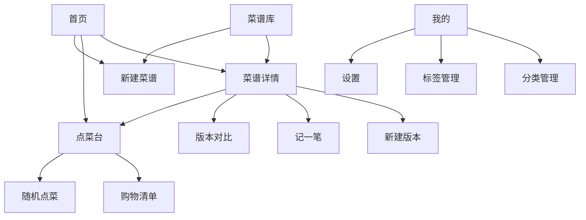
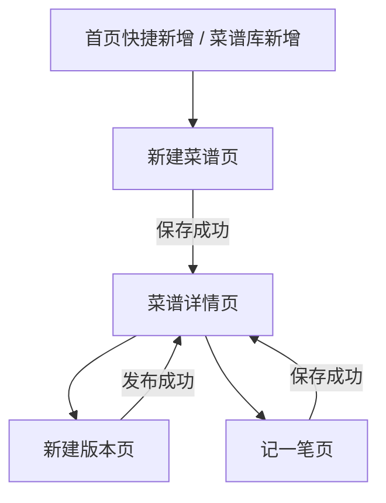
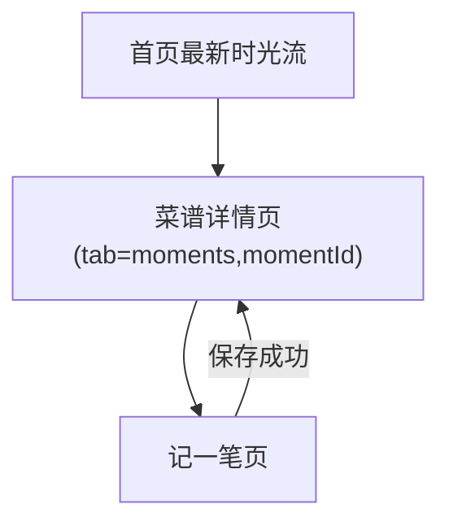
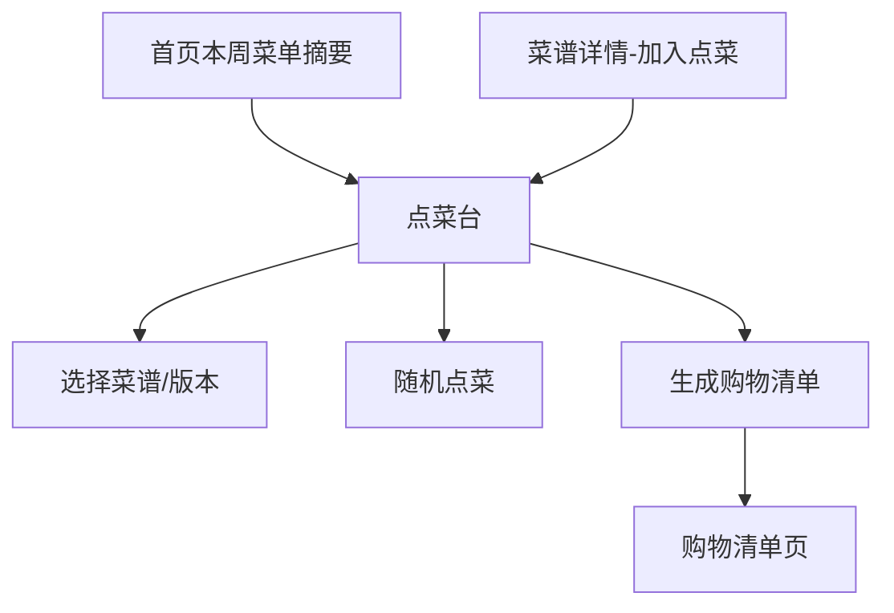
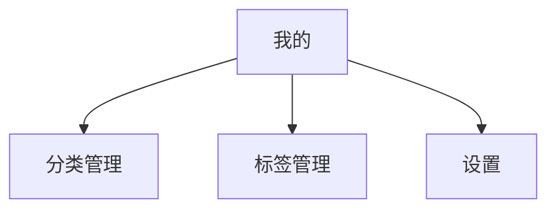

# 食光记页面路由与跳转图

## 1. 文档说明

本文档补齐“食光记”前端页面路由、分包配置、页面打开方式和核心业务跳转关系，作为 Taro 小程序工程 `app.config.ts`、导航封装和页面开发的直接参考。

输入依据：

- [前端技术方案](D:/AI/Menu%20Time/docs/frontend/前端技术方案.md)
- [需求文档v2](D:/AI/Menu%20Time/docs/需求文档v2.md)
- [API 接口清单](D:/AI/Menu%20Time/docs/backend/API%20接口清单.md)
- `stitch_prd/` 页面原型

## 2. 路由设计原则

### 2.1 目标

- 与微信小程序导航模型保持一致。
- 核心闭环路径尽量短，减少多层返回链。
- tab 页只承担一级导航，不承载复杂事务。
- 通过分包控制主包体积和首屏加载压力。

### 2.2 打开方式约定

| 场景 | Taro API | 说明 |
| --- | --- | --- |
| tab 页切换 | `Taro.switchTab` | 首页、菜谱库、点菜台、我的 |
| 常规二级页进入 | `Taro.navigateTo` | 详情、编辑、对比、记录、管理页 |
| 提交成功后替换流程页 | `Taro.redirectTo` | 新建菜谱、新建版本、记一笔等完成后 |
| 登录态失效重置 | `Taro.reLaunch` | 重新回到首页或登录页 |
| 关闭当前流程页 | `Taro.navigateBack` | 管理页、对比页、设置页等 |

### 2.3 参数传递原则

- 路由参数只传轻量字段，不传大型对象。
- 页面需要的复杂数据通过 Query 缓存、store 或重新请求获取。
- 列表筛选条件优先放页面本地状态或本地存储，不在 query 中拼一长串参数。

建议的 query 参数：

- `id`
- `recipeId`
- `versionId`
- `sourceVersionId`
- `momentId`
- `weekStartDate`
- `shoppingListId`
- `tab`

## 3. 页面路由清单

### 3.1 tabBar 页面

| 页面 | 路由 | 页面职责 | 打开方式 |
| --- | --- | --- | --- |
| 首页 | `/pages/home/index` | 本周菜单摘要、最新时光流、快捷入口 | 默认首页 / `switchTab` |
| 菜谱库 | `/pages/recipe-library/index` | 搜索、分类筛选、标签筛选、菜谱列表 | `switchTab` |
| 点菜台 | `/pages/meal-planner/index` | 当前周菜单、手动点菜、购物清单入口、随机点菜入口 | `switchTab` |
| 我的 | `/pages/my/index` | 分类管理、标签管理、设置入口 | `switchTab` |

### 3.2 `recipe` 分包

| 页面 | 路由 | 参数 | 页面职责 |
| --- | --- | --- | --- |
| 菜谱详情 | `/packages/recipe/detail/index` | `id`, `tab?`, `momentId?` | 展示做法、版本、时光轴 |
| 新建菜谱 / 编辑基础信息 | `/packages/recipe/edit/index` | `id?` | 无 `id` 为创建，有 `id` 为编辑 |
| 新建版本 | `/packages/recipe/version-create/index` | `recipeId`, `sourceVersionId?` | 基于指定版本复制草稿 |
| 版本对比 | `/packages/recipe/version-compare/index` | `recipeId`, `base`, `target` | 展示差异摘要与版本内容 |
| 记一笔 | `/packages/recipe/moment-edit/index` | `recipeId`, `versionId?`, `momentId?` | 新建或编辑时光记录 |

### 3.3 `planner` 分包

| 页面 | 路由 | 参数 | 页面职责 |
| --- | --- | --- | --- |
| 随机点菜 | `/packages/planner/random-pick/index` | `weekStartDate?` | 维护筛选条件、展示抽取结果 |
| 购物清单 | `/packages/planner/shopping-list/index` | `id` 或 `weekStartDate?` | 展示/编辑购物清单 |

### 3.4 `profile` 分包

| 页面 | 路由 | 参数 | 页面职责 |
| --- | --- | --- | --- |
| 分类管理 | `/packages/profile/category-manage/index` | 无 | 分类增删改排 |
| 标签管理 | `/packages/profile/tag-manage/index` | 无 | 标签增删改 |
| 设置 | `/packages/profile/settings/index` | 无 | 基础设置、账户摘要、二期入口预留 |

## 4. Taro 分包配置草案

```ts
// miniapp/src/app.config.ts
export default defineAppConfig({
  pages: [
    'pages/home/index',
    'pages/recipe-library/index',
    'pages/meal-planner/index',
    'pages/my/index',
  ],
  subpackages: [
    {
      root: 'packages/recipe',
      pages: [
        'detail/index',
        'edit/index',
        'version-create/index',
        'version-compare/index',
        'moment-edit/index',
      ],
    },
    {
      root: 'packages/planner',
      pages: [
        'random-pick/index',
        'shopping-list/index',
      ],
    },
    {
      root: 'packages/profile',
      pages: [
        'category-manage/index',
        'tag-manage/index',
        'settings/index',
      ],
    },
  ],
  tabBar: {
    color: '#6e6353',
    selectedColor: '#a84533',
    backgroundColor: '#fffcf7',
    borderStyle: 'white',
    list: [
      { pagePath: 'pages/home/index', text: '首页' },
      { pagePath: 'pages/recipe-library/index', text: '菜谱库' },
      { pagePath: 'pages/meal-planner/index', text: '点菜台' },
      { pagePath: 'pages/my/index', text: '我的' },
    ],
  },
})
```

## 5. 路由常量建议

```ts
export const routes = {
  home: '/pages/home/index',
  recipeLibrary: '/pages/recipe-library/index',
  mealPlanner: '/pages/meal-planner/index',
  my: '/pages/my/index',
  recipeDetail: '/packages/recipe/detail/index',
  recipeEdit: '/packages/recipe/edit/index',
  versionCreate: '/packages/recipe/version-create/index',
  versionCompare: '/packages/recipe/version-compare/index',
  momentEdit: '/packages/recipe/moment-edit/index',
  randomPick: '/packages/planner/random-pick/index',
  shoppingList: '/packages/planner/shopping-list/index',
  categoryManage: '/packages/profile/category-manage/index',
  tagManage: '/packages/profile/tag-manage/index',
  settings: '/packages/profile/settings/index',
} as const
```

## 6. 全局页面关系图



## 7. 核心业务跳转链路

### 7.1 菜谱创建闭环



### 7.2 时光记录闭环



### 7.3 点菜与购物清单闭环



### 7.4 个人设置与管理链路



## 8. 页面入参与回跳策略

### 8.1 菜谱详情

入参：

- `id`
- `tab?`
- `momentId?`

回跳策略：

- 从首页、菜谱库、点菜台进入：正常返回上一页。
- 从新建成功跳转：使用 `redirectTo`，避免返回到已提交的草稿页。

### 8.2 新建菜谱 / 编辑基础信息

入参：

- `id?`

回跳策略：

- 创建成功：`redirectTo(recipeDetail?id=xxx)`。
- 编辑成功：`navigateBack()` 或 `redirectTo(recipeDetail?id=xxx)`，按是否需要强刷详情页决定。

### 8.3 新建版本

入参：

- `recipeId`
- `sourceVersionId?`

回跳策略：

- 发布成功：`redirectTo(recipeDetail?id=xxx&tab=versions)`。

### 8.4 记一笔

入参：

- `recipeId`
- `versionId?`
- `momentId?`

回跳策略：

- 保存成功：`redirectTo(recipeDetail?id=xxx&tab=timeline)`。

### 8.5 购物清单

入参：

- `id`

回跳策略：

- 正常返回点菜台。
- 如果从生成清单流程进入，优先保留点菜台作为上级页。

## 9. 页面守卫与缺参处理

| 页面 | 前置校验 | 处理方式 |
| --- | --- | --- |
| 菜谱详情 | 必须有 `id` | toast 提示后返回上一页 |
| 新建版本 | 必须有 `recipeId` | 缺参则返回详情页或菜谱库 |
| 版本对比 | 必须有 `recipeId/base/target` | 缺参则阻止渲染并返回 |
| 记一笔 | 必须有 `recipeId` | 无参数时禁止提交 |
| 购物清单 | 必须有 `id` 或可解析 `weekStartDate` | 进入页后立即拉详情或生成态检查 |

## 10. 首屏请求建议

| 页面 | 首屏请求 |
| --- | --- |
| 首页 | 当前周菜单摘要、最新时光流 |
| 菜谱库 | 分类列表、标签列表、菜谱列表 |
| 点菜台 | 当前周菜单 |
| 我的 | 当前会话、基础统计信息 |
| 菜谱详情 | 菜谱详情；版本列表和时光轴按 tab 延迟加载 |

## 11. 后续可扩展路由

当前不进入 MVP，但建议预留信息结构：

- 全局时光轴页
- 家庭协作页
- 分享图预览页
- 登录页和登录重定向页
