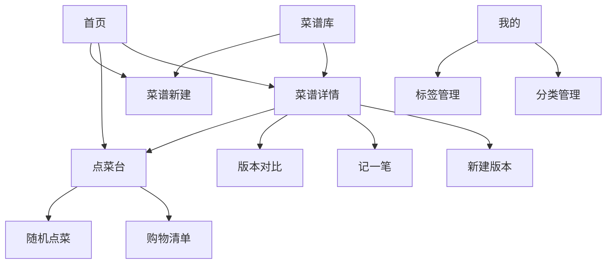
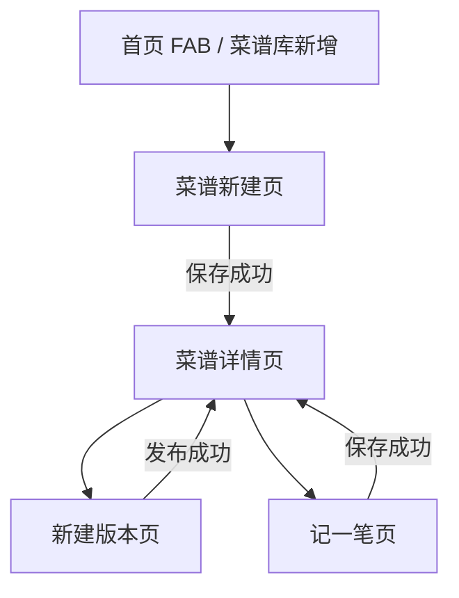
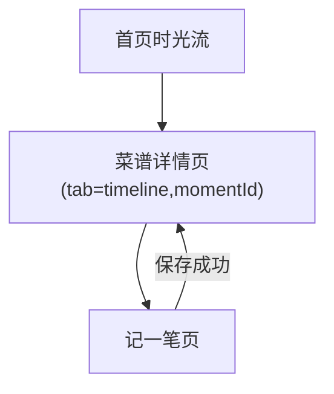
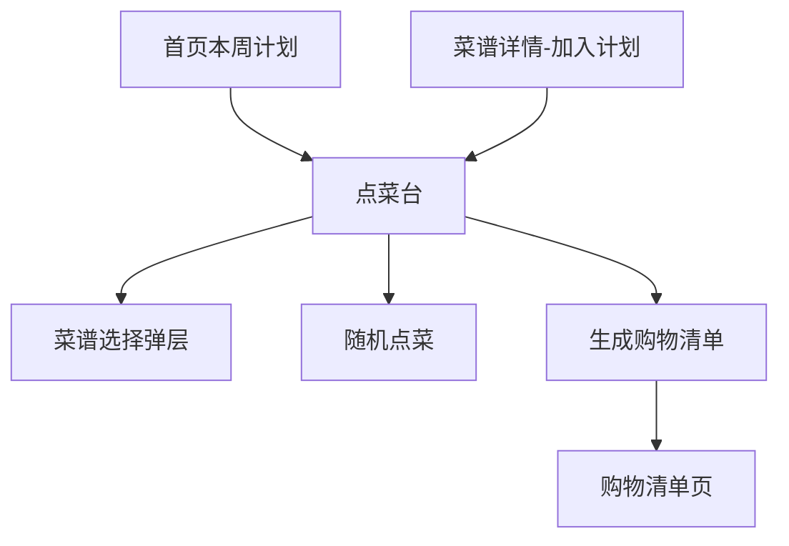
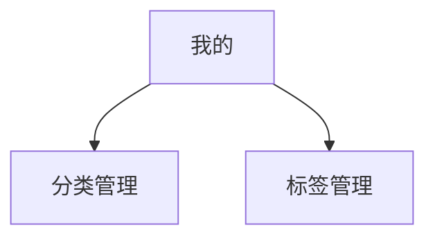

# 食光记页面路由与跳转图

## 1. 文档说明

本文档用于补齐“食光记”前端页面路由、分包结构、页面打开方式与核心跳转关系，作为 Taro 小程序工程配置与页面开发的直接参考。

输入依据：

- [前端技术方案.md](D:/AI/Menu Time/前端技术方案.md)
- [需求文档v2.md](D:/AI/Menu Time/需求文档v2.md)
- `stitch_prd/` 页面原型

## 2. 路由设计原则

### 2.1 设计目标

- 与小程序导航模型一致
- 保持核心闭环路径尽量短
- 复杂事务页不放入 `tabBar`
- 通过分包控制主包体积

### 2.2 打开方式约定

| 场景 | Taro API | 说明 |
| --- | --- | --- |
| tab 页切换 | `Taro.switchTab` | 首页、菜谱库、计划、我的 |
| 常规详情进入 | `Taro.navigateTo` | 详情、编辑、对比、记录等 |
| 提交后替换当前流程页 | `Taro.redirectTo` | 新建成功后跳详情，避免返回空草稿页 |
| 登录态失效重置应用 | `Taro.reLaunch` | 登录页或首页 |
| 返回上一页 | `Taro.navigateBack` | 表单、管理页、对比页 |

### 2.3 参数传递原则

- 轻量参数走 query
- 复杂对象不走 query，使用缓存或 store
- 列表页筛选条件尽量使用页面内状态和本地存储，不在 URL 串联

常用 query 约定：

- `id`
- `recipeId`
- `versionId`
- `momentId`
- `base`
- `target`
- `weekStartDate`
- `shoppingListId`
- `tab`

## 3. 路由清单

### 3.1 tabBar 页面

| 页面 | 路由 | 页面职责 | 进入方式 | 离开方式 |
| --- | --- | --- | --- | --- |
| 首页 | `pages/home/index` | 本周计划摘要、最新时光流、全局新增入口 | 默认首页 | `switchTab` / `navigateTo` |
| 菜谱库 | `pages/recipe-list/index` | 菜谱搜索、分类/标签筛选、列表浏览 | tab 切换 | `navigateTo` |
| 计划 | `pages/planner/index` | 当前周菜单、餐次管理、随机点菜入口 | tab 切换 | `navigateTo` |
| 我的 | `pages/profile/index` | 分类/标签管理入口、设置入口 | tab 切换 | `navigateTo` |

### 3.2 主包非 tab 页面

| 页面 | 路由 | 参数 | 说明 |
| --- | --- | --- | --- |
| 菜谱详情 | `pages/recipe-detail/index` | `id`, `tab?`, `momentId?` | 菜谱核心聚合页 |

### 3.3 `recipe` 分包

| 页面 | 路由 | 参数 | 说明 |
| --- | --- | --- | --- |
| 菜谱新建/编辑 | `packageRecipe/pages/recipe-edit/index` | `id?` | 无 `id` 为创建，有 `id` 为编辑 |
| 新建版本 | `packageRecipe/pages/version-create/index` | `recipeId`, `baseVersionId?` | 默认复制当前版本 |
| 版本对比 | `packageRecipe/pages/version-compare/index` | `recipeId`, `base`, `target` | 展示变更摘要与版本内容 |
| 记一笔 | `packageRecipe/pages/moment-edit/index` | `recipeId`, `versionId?`, `redirectTab?` | 记录时光内容 |

### 3.4 `feature` 分包

| 页面 | 路由 | 参数 | 说明 |
| --- | --- | --- | --- |
| 购物清单 | `packageFeature/pages/shopping-list/index` | `id` | 根据清单 ID 查看/编辑 |
| 随机点菜 | `packageFeature/pages/random-pick/index` | `weekStartDate?` | 阶段 B 功能 |
| 全局时光轴 | `packageFeature/pages/timeline/index` | `recipeId?` | 阶段 B 功能 |

### 3.5 `manage` 分包

| 页面 | 路由 | 参数 | 说明 |
| --- | --- | --- | --- |
| 分类管理 | `packageManage/pages/category-manage/index` | 无 | 分类增删改排 |
| 标签管理 | `packageManage/pages/tag-manage/index` | `group?` | 标签分组管理 |

## 4. Taro 分包配置草案

```ts
// src/app.config.ts
export default defineAppConfig({
  pages: [
    'pages/home/index',
    'pages/recipe-list/index',
    'pages/planner/index',
    'pages/profile/index',
    'pages/recipe-detail/index',
  ],
  subpackages: [
    {
      root: 'packageRecipe',
      pages: [
        'pages/recipe-edit/index',
        'pages/version-create/index',
        'pages/version-compare/index',
        'pages/moment-edit/index',
      ],
    },
    {
      root: 'packageFeature',
      pages: [
        'pages/shopping-list/index',
        'pages/random-pick/index',
        'pages/timeline/index',
      ],
    },
    {
      root: 'packageManage',
      pages: [
        'pages/category-manage/index',
        'pages/tag-manage/index',
      ],
    },
  ],
  tabBar: {
    list: [
      { pagePath: 'pages/home/index', text: '首页' },
      { pagePath: 'pages/recipe-list/index', text: '菜谱库' },
      { pagePath: 'pages/planner/index', text: '计划' },
      { pagePath: 'pages/profile/index', text: '我的' },
    ],
  },
})
```

## 5. 路由常量建议

```ts
export const routes = {
  home: '/pages/home/index',
  recipeList: '/pages/recipe-list/index',
  planner: '/pages/planner/index',
  profile: '/pages/profile/index',
  recipeDetail: '/pages/recipe-detail/index',
  recipeEdit: '/packageRecipe/pages/recipe-edit/index',
  versionCreate: '/packageRecipe/pages/version-create/index',
  versionCompare: '/packageRecipe/pages/version-compare/index',
  momentEdit: '/packageRecipe/pages/moment-edit/index',
  shoppingList: '/packageFeature/pages/shopping-list/index',
  randomPick: '/packageFeature/pages/random-pick/index',
  timeline: '/packageFeature/pages/timeline/index',
  categoryManage: '/packageManage/pages/category-manage/index',
  tagManage: '/packageManage/pages/tag-manage/index',
} as const
```

## 6. 全局跳转图



## 7. 关键业务跳转链路

### 7.1 菜谱创建闭环



### 7.2 时光记录闭环



### 7.3 点菜与购物清单闭环



### 7.4 管理配置链路



## 8. 页面入参与回跳策略

### 8.1 菜谱详情

入参：

- `id`
- `tab?`
- `momentId?`

回跳策略：

- 从首页、菜谱库进入：正常返回上一页
- 从新建或编辑成功跳转：使用 `redirectTo`，避免返回草稿页

### 8.2 菜谱新建/编辑

入参：

- `id?`

回跳策略：

- 创建成功：`redirectTo(recipeDetail)`
- 编辑成功：`navigateBack` 或 `redirectTo(recipeDetail)`，以是否需要强刷详情页为准

### 8.3 新建版本

入参：

- `recipeId`
- `baseVersionId?`

回跳策略：

- 发布成功后 `redirectTo(recipeDetail?id=xxx&tab=versions)`

### 8.4 记一笔

入参：

- `recipeId`
- `versionId?`
- `redirectTab?`

回跳策略：

- 保存成功后 `redirectTo(recipeDetail?id=xxx&tab=timeline)`

### 8.5 购物清单

入参：

- `id`

回跳策略：

- 正常返回点菜台

## 9. 页面守卫与前置数据约定

| 页面 | 前置校验 | 处理方式 |
| --- | --- | --- |
| 菜谱详情 | 必须有 `id` | 无 `id` 则 toast + 返回 |
| 新建版本 | 必须有 `recipeId` | 无参数则返回详情或菜谱库 |
| 版本对比 | 必须有 `recipeId/base/target` | 缺参则 toast + 返回 |
| 记一笔 | 必须有 `recipeId` | 无参数则阻止提交 |
| 购物清单 | 必须有 `id` | 进入页后立即拉取详情 |

## 10. 首屏请求建议

| 页面 | 首屏请求 |
| --- | --- |
| 首页 | 当前周菜单摘要、最新时光流 |
| 菜谱库 | 分类列表、标签列表、菜谱列表 |
| 点菜台 | 当前周菜单 |
| 我的 | 会话信息、统计信息 |
| 菜谱详情 | 菜谱详情，其他 tab 延迟加载 |

## 11. 待后续补充

- 登录页与登录后重定向路径
- 家庭协作页路由
- 系统设置页路由
- 分享链路与海报生成后的落地页
